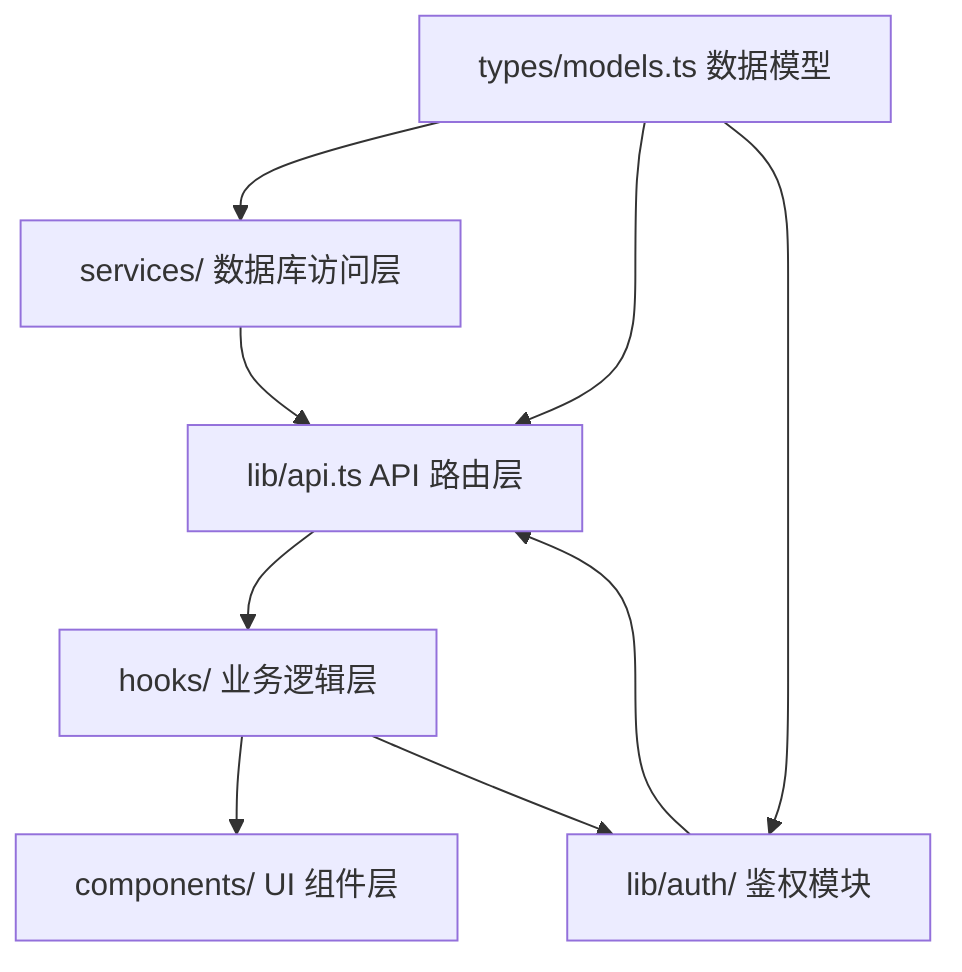

# 模块依赖地图

> 本文件是项目模块间的依赖关系图。修改任意模块前，必须先查看本文件，确认影响范围。

## 依赖关系图

## 关键依赖矩阵

| 被依赖方（修改它会影响） | 依赖方列表 | 影响程度 | 检查要点 |
|---|---|---|---|
| User 类型定义 | services/user.ts, lib/auth/guard.ts, hooks/useUser.ts, pages/profile/*, components/UserMenu.tsx | 高 | 所有引用 User 字段的地方 |
| api.ts 中的函数签名 | hooks/*, pages/*, components/* | 高 | 所有调用该函数的文件 |
| 数据库表结构 | services/*, types/models.ts | 极高 | 数据迁移、旧数据兼容 |
| 鉴权中间件 | 所有 API 路由 | 极高 | Token 格式、权限逻辑 |
| UI 基础组件 | 所有页面和业务组件 | 中 | Props 接口、样式变化 |

## 修改检查清单
当修改 **[模块名称]** 时，必须按顺序检查以下文件：

### 修改 User 类型
- [ ] types/models.ts — 定义本身
- [ ] services/user.ts — 数据库查询适配
- [ ] lib/auth/guard.ts — 鉴权中间件适配
- [ ] hooks/useUser.ts — 前端状态管理适配
- [ ] pages/profile/* — 用户资料展示端适配
- [ ] components/UserMenu.tsx — UI 组件适配

### 修改 API 接口
- [ ] lib/api.ts — 接口定义
- [ ] 所有调用该接口的 hooks
- [ ] 所有调用该接口的页面组件
- [ ] 相关测试文件

### 修改数据库表
- [ ] types/models.ts — 类型定义同步
- [ ] services/ 中相关查询
- [ ] 数据迁移脚本
- [ ] 种子数据文件
