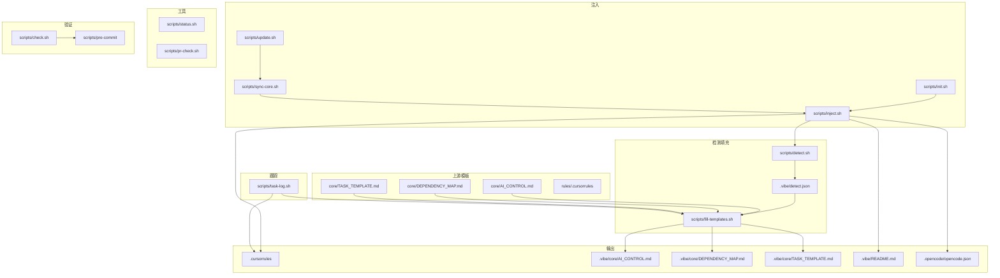

# 模块依赖地图

> 本文件是项目模块间的依赖关系图。修改任意模块前，必须先查看本文件，确认影响范围。
>
> **使用方法**：接入项目后，根据实际项目结构填写下方各节内容。

## 依赖关系图

## 关键依赖矩阵

| 被依赖方（修改它会影响） | 依赖方列表 | 影响程度 | 检查要点 |
|---|---|---|---|
| `scripts/detect.sh` | fill-templates.sh, sync-templates.sh, inject.sh | 高 | detect.json 的 key 名与 fill-templates 的 PLACEHOLDER_MAP 必须同步 |
| `scripts/fill-templates.sh` | sync-templates.sh, inject.sh | 高 | 占位符映射与 detect.json key 一致；输出路径与 opencode.json 中 instructions 一致 |
| `scripts/inject.sh` | init.sh, sync-core.sh | 极高 | 每次修改 inject 行为后必须重新注入测试；.vibe/ 输出结构变化需同步 check.sh 和 .gitignore |
| `scripts/check.sh` | pre-commit | 高 | check 项增减需对应更新 pre-commit 预期 |
| `scripts/status.sh` | 无（叶子节点） | 低 | 只读工具，修改后运行一次确认输出正确 |
| `scripts/pr-check.sh` | check.sh | 中 | 依赖 check.sh 返回值；日志摘要格式需与 task-log 模板一致 |
| `scripts/task-log.sh` | check.sh, fill-templates.sh | 中 | 新 key 需同步 PLACEHOLDER_MAP；check.sh 中任务日志检查逻辑需同步格式 |
| `.opencode/opencode.json` | opencode CLI | 高 | instructions 路径必须指向实际存在的文件（core/* 或 .vibe/core/*） |
| `core/*.md` 模板 | fill-templates.sh | 中 | 模板中的占位符名与 detect.json 的 key 以及 PLACEHOLDER_MAP 三方一致 |

## 修改检查清单

### 修改 detect.sh
- [ ] scripts/detect.sh — 检测逻辑本身
- [ ] scripts/fill-templates.sh — PLACEHOLDER_MAP 是否需同步新 key
- [ ] .vibe/detect.json — 测试检测输出格式

### 修改 fill-templates.sh
- [ ] scripts/fill-templates.sh — 替换逻辑
- [ ] scripts/detect.sh — 确保 detect.json 输出对应 key
- [ ] .vibe/core/* — 测试填充结果
- [ ] 各 core/*.md 模板 — 检查占位符是否被正确映射

### 修改 task-log.sh
- [ ] scripts/task-log.sh — 日志模板格式
- [ ] scripts/check.sh — 任务日志检查逻辑
- [ ] SKILL.md — 工作流中引用的 task-log 路径
- [ ] .vibe/tasks/ — 测试日志生成结果

### 修改 status.sh
- [ ] scripts/status.sh — 输出内容和格式
- [ ] README.md — 文件说明表是否同步
- [ ] 两种模式（自托管 / 注入）分别测试

### 修改 pr-check.sh
- [ ] scripts/pr-check.sh — check.sh 调用 + 日志解析 + 摘要格式
- [ ] scripts/check.sh — 如 check 项变化，需确认 pr-check 仍正确捕获退出码
- [ ] README.md — 文件说明表是否同步

### 修改 inject.sh
- [ ] scripts/inject.sh — 注入逻辑
- [ ] scripts/check.sh — 检查项是否需同步
- [ ] .gitignore — .vibe/ 忽略规则
- [ ] 自托管：重跑 inject.sh 验证

### 新增脚本
- [ ] 在依赖关系图中增加节点和连线
- [ ] 在依赖矩阵中增加新行的上下游关系
- [ ] 检查是否有调用链上游需要同步（如 inject.sh 检测并调 sync-templates.sh）
- [ ] 更新 .vibe/core/DEPENDENCY_MAP.md（跑 sync-templates.sh）
