# 模块依赖地图

> 本文件是项目模块间的依赖关系图。修改任意模块前，必须先查看本文件，确认影响范围。
>
> **使用方法**：接入项目后，根据实际项目结构填写下方各节内容。

<!-- DEPGRAPH_START -->
<!-- 由 generate-depmap.sh 自动生成，请勿手动编辑 -->

## 依赖关系图

```mermaid
graph TD

    subgraph 脚本
    s_pre-commit[pre-commit]
    s_pre-push[pre-push]
    s_check_sh[check.sh]
    s_detect_sh[detect.sh]
    s_fill-templates_sh[fill-templates.sh]
    s_generate-depmap_sh[generate-depmap.sh]
    s_init_sh[init.sh]
    s_inject_sh[inject.sh]
    s_pr-check_sh[pr-check.sh]
    s_recover_sh[recover.sh]
    s_scan-modules_sh[scan-modules.sh]
    s_scope-check_sh[scope-check.sh]
    s_status_sh[status.sh]
    s_sync-core_sh[sync-core.sh]
    s_sync-templates_sh[sync-templates.sh]
    s_task-log_sh[task-log.sh]
    s_update_sh[update.sh]
    end

    subgraph 文件与配置
    _cursorrules[.cursorrules]
    _git_hooks_pre-commit[.git/hooks/pre-commit]
    _git_hooks_pre-push[.git/hooks/pre-push]
    _gitignore[.gitignore]
    _opencode_opencode_json[.opencode/opencode.json]
    _vibe_core_[.vibe/core/]
    _vibe_core_*_md[.vibe/core/*.md]
    _vibe_tasks_*_md[.vibe/tasks/*.md]
    _vibe_tasks_YYYYMMDD[.vibe/tasks/YYYYMMDD]
    core_AI_CONTROL_md[core/AI_CONTROL.md]
    vibe-control[vibe-control]
    end

    s_SKILL.md --> s_check.sh
    s_SKILL.md --> s_recover.sh
    s_SKILL.md --> s_scope-check.sh
    s_SKILL.md --> s_sync-templates.sh
    s_SKILL.md --> s_task-log.sh
    s_pre-commit --> s_check.sh
    s_pre-push --> s_pr-check.sh
    s_check.sh --> s_recover.sh
    s_init.sh --> s_inject.sh
    s_inject.sh --> s_sync-templates.sh
    s_sync-core.sh --> s_inject.sh
    s_sync-templates.sh --> s_detect.sh
    s_sync-templates.sh --> s_fill-templates.sh
    s_sync-templates.sh --> s_generate-depmap.sh
    s_sync-templates.sh --> s_scan-modules.sh
    s_inject.sh -->|写入| _gitignore
    s_inject.sh -->|写入| _opencode_opencode_json
    s_inject.sh -.->|安装| _cursorrules
    s_inject.sh -.->|安装| _git_hooks_pre-commit
    s_inject.sh -.->|安装| _git_hooks_pre-push
    s_inject.sh -.->|安装| vibe-control
```

## 关键依赖矩阵

| 被依赖方（修改它会影响） | 依赖方列表 | 影响程度 | 检查要点 |
|---|---|---|---|
| `pre-commit` | - | 低 | 叶子节点，影响范围有限 |
| `pre-push` | - | 低 | 叶子节点，影响范围有限 |
| `check.sh` | SKILL.md, pre-commit | 中 | 调用方返回值或接口需同步 |
| `detect.sh` | sync-templates.sh | 中 | 调用方返回值或接口需同步 |
| `fill-templates.sh` | sync-templates.sh | 中 | 调用方返回值或接口需同步 |
| `generate-depmap.sh` | sync-templates.sh | 中 | 调用方返回值或接口需同步 |
| `init.sh` | - | 低 | 叶子节点，影响范围有限 |
| `inject.sh` | init.sh, sync-core.sh | 中 | 调用方返回值或接口需同步 |
| `pr-check.sh` | pre-push | 中 | 调用方返回值或接口需同步 |
| `recover.sh` | SKILL.md, check.sh | 中 | 调用方返回值或接口需同步 |
| `scan-modules.sh` | sync-templates.sh | 中 | 调用方返回值或接口需同步 |
| `scope-check.sh` | SKILL.md | 中 | 调用方返回值或接口需同步 |
| `status.sh` | - | 低 | 叶子节点，影响范围有限 |
| `sync-core.sh` | - | 低 | 叶子节点，影响范围有限 |
| `sync-templates.sh` | SKILL.md, inject.sh | 中 | 调用方返回值或接口需同步 |
| `task-log.sh` | SKILL.md | 中 | 调用方返回值或接口需同步 |
| `update.sh` | - | 低 | 叶子节点，影响范围有限 |

## 修改检查清单

### 修改 pre-commit
- [ ] pre-commit — 修改本身

### 修改 pre-push
- [ ] pre-push — 修改本身

### 修改 scripts/check.sh
- [ ] scripts/check.sh — 修改本身
- [ ] SKILL.md — 工作流中引用需同步
- [ ] pre-commit — 调用方返回值或接口需同步

### 修改 scripts/detect.sh
- [ ] scripts/detect.sh — 修改本身
- [ ] sync-templates.sh — 调用方返回值或接口需同步

### 修改 scripts/fill-templates.sh
- [ ] scripts/fill-templates.sh — 修改本身
- [ ] sync-templates.sh — 调用方返回值或接口需同步

### 修改 scripts/generate-depmap.sh
- [ ] scripts/generate-depmap.sh — 修改本身
- [ ] sync-templates.sh — 调用方返回值或接口需同步

### 修改 scripts/init.sh
- [ ] scripts/init.sh — 修改本身

### 修改 scripts/inject.sh
- [ ] scripts/inject.sh — 修改本身
- [ ] init.sh — 调用方返回值或接口需同步
- [ ] sync-core.sh — 调用方返回值或接口需同步
- [ ] .gitignore — 输出内容或格式需同步
- [ ] .opencode/opencode.json — 输出内容或格式需同步
- [ ] .cursorrules — 安装逻辑需同步
- [ ] .git/hooks/pre-commit — 安装逻辑需同步
- [ ] .git/hooks/pre-push — 安装逻辑需同步
- [ ] vibe-control — 安装逻辑需同步

### 修改 scripts/pr-check.sh
- [ ] scripts/pr-check.sh — 修改本身
- [ ] pre-push — 调用方返回值或接口需同步

### 修改 scripts/recover.sh
- [ ] scripts/recover.sh — 修改本身
- [ ] SKILL.md — 工作流中引用需同步
- [ ] check.sh — 调用方返回值或接口需同步

### 修改 scripts/scan-modules.sh
- [ ] scripts/scan-modules.sh — 修改本身
- [ ] sync-templates.sh — 调用方返回值或接口需同步

### 修改 scripts/scope-check.sh
- [ ] scripts/scope-check.sh — 修改本身
- [ ] SKILL.md — 工作流中引用需同步

### 修改 scripts/status.sh
- [ ] scripts/status.sh — 修改本身

### 修改 scripts/sync-core.sh
- [ ] scripts/sync-core.sh — 修改本身

### 修改 scripts/sync-templates.sh
- [ ] scripts/sync-templates.sh — 修改本身
- [ ] SKILL.md — 工作流中引用需同步
- [ ] inject.sh — 调用方返回值或接口需同步

### 修改 scripts/task-log.sh
- [ ] scripts/task-log.sh — 修改本身
- [ ] SKILL.md — 工作流中引用需同步

### 修改 scripts/update.sh
- [ ] scripts/update.sh — 修改本身
<!-- DEPGRAPH_END -->

<!-- PROJECT_DEPS_START -->
<!-- 由 scan-modules.sh 自动生成，每次 sync-templates 时刷新 -->
<!-- PROJECT_DEPS_END -->
