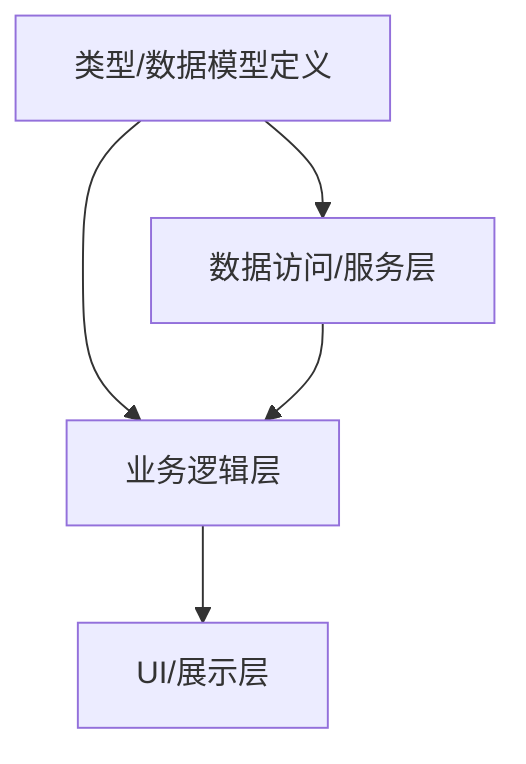

# 模块依赖地图

> 本文件是项目模块间的依赖关系图。修改任意模块前，必须先查看本文件，确认影响范围。
>
> **使用方法**：接入项目后，根据实际项目结构填写下方各节内容。

## 依赖关系图

将项目中各层之间的依赖关系画为流程图，箭头表示"依赖方向"，即被修改方 → 受影响方。



> 根据项目实际情况增减层级。典型层次（任选适用项）：
> - 类型定义（types / models / DTO）
> - 数据访问（services / repository / DAO）
> - API 路由（controller / handler / resolver）
> - 业务逻辑（hooks / composables / domain）
> - UI 展示（components / pages / views）
> - 共享工具（utils / lib / helpers）

## 关键依赖矩阵

> 在下表中列出项目的核心模块及它们的上下游依赖方。示例格式：

| 被依赖方（修改它会影响） | 依赖方列表 | 影响程度 | 检查要点 |
|---|---|---|---|
| **[模块A]** | [列出依赖它的文件/模块] | 高/中/低 | [修改后需要验证哪些行为] |
| **[模块B]** | [列出依赖它的文件/模块] | 高/中/低 | [修改后需要验证哪些行为] |

### 填写指南

- **被依赖方**：一个经常被其他模块引用的核心模块（类型定义、API 封装、鉴权中间件等）
- **依赖方列表**：通过全局搜索引用关系来确定，列出所有 `import` 或调用该模块的文件
- **影响程度**：
  - **极高** — 涉及数据库结构或外部接口契约，修改可能导致数据丢失或外部不可用
  - **高** — 涉及核心类型或 API 签名，大量文件直接依赖
  - **中** — 涉及 UI 组件 Props 或工具函数签名，影响范围有限
  - **低** — 仅内部实现变更，不影响外部接口
- **检查要点**：修改后必须逐一验证的关键行为

## 修改检查清单模板

当修改 **[模块名称]** 时，复制以下模板按顺序逐项检查：

```
### 修改 [模块名称]
- [ ] [定义文件] — 修改定义本身
- [ ] [关联文件1] — [需要适配什么]
- [ ] [关联文件2] — [需要适配什么]
- [ ] [关联测试] — [验证方式]
```

### 一般检查流程

1. **搜索引用** — 使用 IDE 的"查找所有引用"或 `grep` 搜索该模块的导入语句
2. **列出影响链** — 从底层（类型/数据）向上层（UI）逐层追踪
3. **逐层验证** — 每层修改后运行该层相关测试
4. **回归检查** — 最终运行全量测试和类型检查

## 新增模块时的要求

向项目新增模块时，必须同步更新本文件：
- 在依赖关系图中增加新节点和连线
- 在依赖矩阵中增加新行的上下游关系
- 为高影响新增模块编写修改检查清单
